# Solubility Prediction Step 1
Mahitab Sakr

Importing libraries:

``` r
library(tidyverse)
library(patchwork) 
```

Reading the data file;

``` r
data <- read.csv("../data/curated-solubility-dataset-5.csv", 
                        sep = ",", header = TRUE)
```

Seeing the structure of the columns in the data file:

``` r
str(data, vec.len=2)
```

    'data.frame':   1982 obs. of  26 variables:
     $ ID                 : chr  "C-1869" "C-1870" ...
     $ Name               : chr  "6-methyl-3h-pteridin-4-one;  4-hydroxy-6-methylpteridine" "2,4-diaminopteridine" ...
     $ InChI              : chr  "InChI=1S/C7H6N4O/c1-4-2-8-6-5(11-4)7(12)10-3-9-6/h2-3H,1H3,(H,8,9,10,12)" "InChI=1S/C6H6N6/c7-4-3-5(10-2-1-9-3)12-6(8)11-4/h1-2H,(H4,7,8,10,11,12)" ...
     $ InChIKey           : chr  "JQDJTEVUGHCYPQ-UHFFFAOYSA-N" "CITCTUNIFJOTHI-UHFFFAOYSA-N" ...
     $ SMILES             : chr  "CC1=NC2=C(N=CNC2=O)N=C1" "NC1=NC2=C(N=CC=N2)C(=N1)N" ...
     $ Solubility         : num  -1.65 -2.69 -5.93 -1.13 -2.71 ...
     $ SD                 : num  0 0 0 0 0 ...
     $ Ocurrences         : int  1 1 1 1 1 ...
     $ Group              : chr  "G1" "G1" ...
     $ MolWt              : num  162 162 ...
     $ MolLogP            : num  0.0215 -0.4158 ...
     $ MolMR              : num  42.7 44 ...
     $ HeavyAtomCount     : num  12 12 26 16 16 ...
     $ NumHAcceptors      : num  4 6 3 5 5 ...
     $ NumHDonors         : num  1 2 0 1 1 ...
     $ NumHeteroatoms     : num  5 6 3 7 5 ...
     $ NumRotatableBonds  : num  0 0 3 4 3 ...
     $ NumValenceElectrons: num  60 60 144 88 78 ...
     $ NumAromaticRings   : num  2 2 0 1 1 ...
     $ NumSaturatedRings  : num  0 0 3 0 0 ...
     $ NumAliphaticRings  : num  0 0 4 0 0 ...
     $ RingCount          : num  2 2 4 1 1 ...
     $ TPSA               : num  71.5 103.6 ...
     $ LabuteASA          : num  67.5 67.7 ...
     $ BalabanJ           : num  2.98 2.89 ...
     $ BertzCT            : num  476 425 ...

Assigning the columns to be removed into a vector called ID_info:

``` r
ID_info <- c("ID","Name", "InChI", "InChIKey", "SMILES", "SD", "Ocurrences")
```

Assigning the columns of the data file to a new file without the
ID_info:

``` r
df = data[,!(names(data) %in% ID_info)]
```

Seeing the structure of the columns in the new data file:

``` r
str(df, vec.len=2)
```

    'data.frame':   1982 obs. of  19 variables:
     $ Solubility         : num  -1.65 -2.69 -5.93 -1.13 -2.71 ...
     $ Group              : chr  "G1" "G1" ...
     $ MolWt              : num  162 162 ...
     $ MolLogP            : num  0.0215 -0.4158 ...
     $ MolMR              : num  42.7 44 ...
     $ HeavyAtomCount     : num  12 12 26 16 16 ...
     $ NumHAcceptors      : num  4 6 3 5 5 ...
     $ NumHDonors         : num  1 2 0 1 1 ...
     $ NumHeteroatoms     : num  5 6 3 7 5 ...
     $ NumRotatableBonds  : num  0 0 3 4 3 ...
     $ NumValenceElectrons: num  60 60 144 88 78 ...
     $ NumAromaticRings   : num  2 2 0 1 1 ...
     $ NumSaturatedRings  : num  0 0 3 0 0 ...
     $ NumAliphaticRings  : num  0 0 4 0 0 ...
     $ RingCount          : num  2 2 4 1 1 ...
     $ TPSA               : num  71.5 103.6 ...
     $ LabuteASA          : num  67.5 67.7 ...
     $ BalabanJ           : num  2.98 2.89 ...
     $ BertzCT            : num  476 425 ...

Adding a new column called Group_num:

``` r
df$Group_num <- NA
```

Assigning the values based on the numbers in the column “Group”.

``` r
df$Group_num[df$Group == "G1"] = 1
df$Group_num[df$Group == "G2"] = 2
df$Group_num[df$Group == "G3"] = 3
df$Group_num[df$Group == "G4"] = 4
df$Group_num[df$Group == "G5"] = 5
```

Looking at the resulted column values:

``` r
table(df$Group_num)
```


       1    2    3    4    5 
    1549   32  242   20  139 

Removing the old Group column from the data file:

``` r
df = subset(df, select = -c(Group))
```

Loop to create a histogram for each column in the data file: (To check
for normal distribution)

``` r
plots <- lapply(names(df), function(column) { 
  ggplot(df, aes(x = .data[[column]])) + 
    geom_histogram(bins = 30, fill = "#560178", color = "white") + 
    labs(title = column, x = column, y = NULL) + 
    theme_minimal(base_size = 9) + 
theme(plot.title = element_text(size = 10, face = "bold")) 
}) 
plots
```

    [[1]]

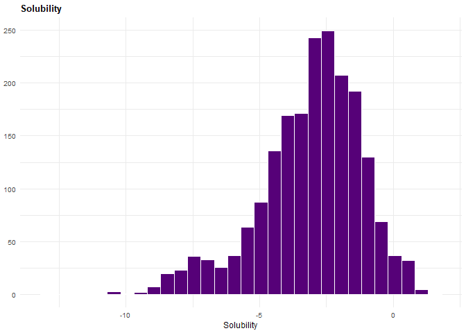


    [[2]]

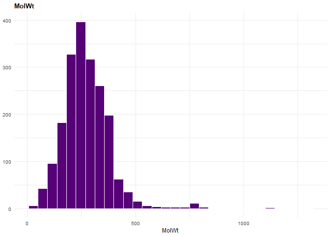


    [[3]]

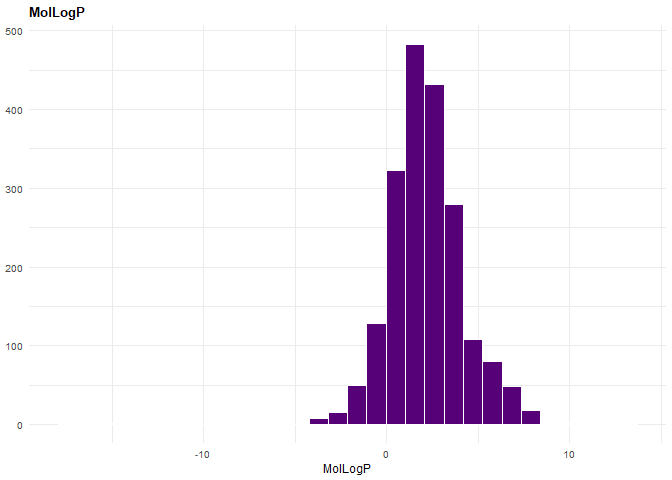


    [[4]]

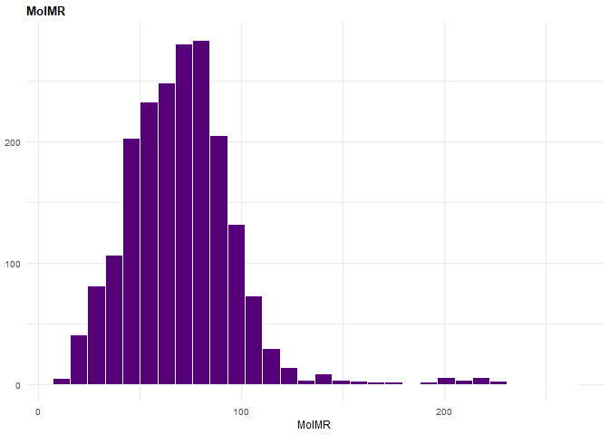


    [[5]]

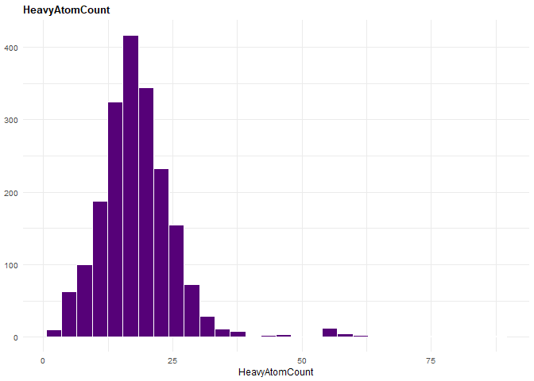


    [[6]]

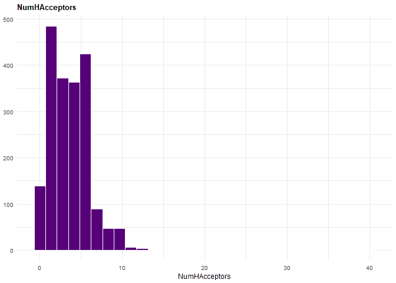


    [[7]]

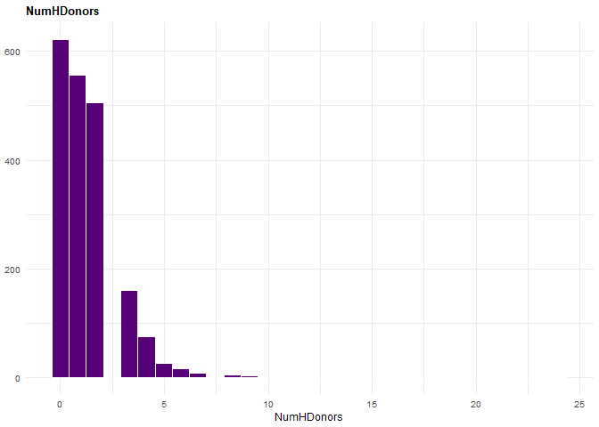


    [[8]]

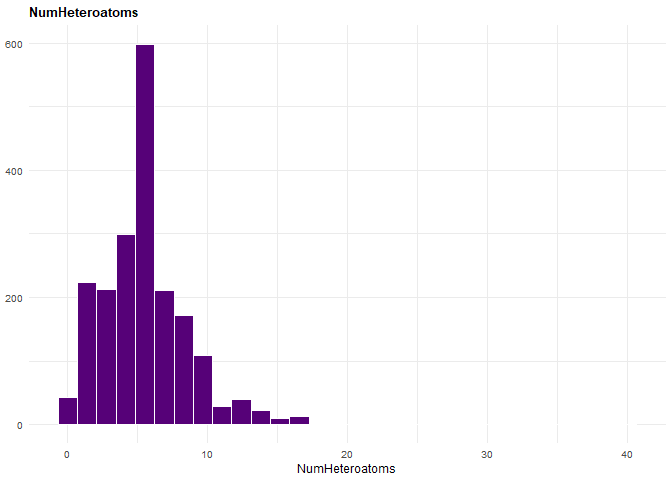


    [[9]]

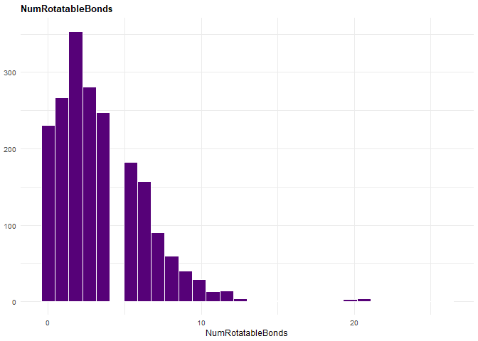


    [[10]]

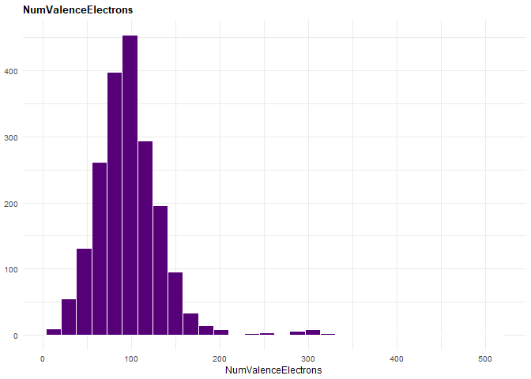


    [[11]]

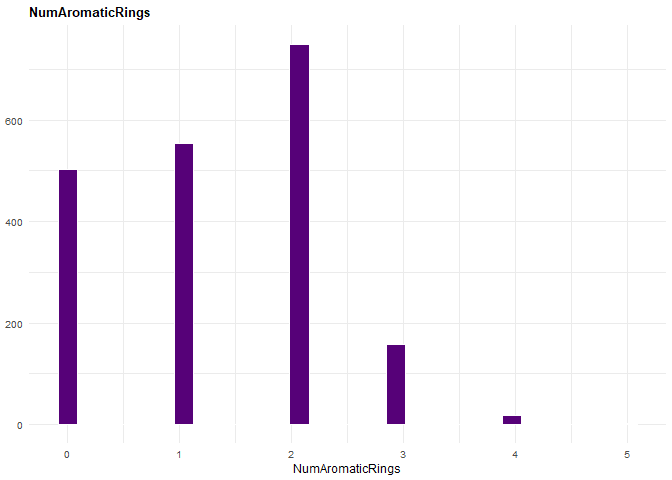


    [[12]]

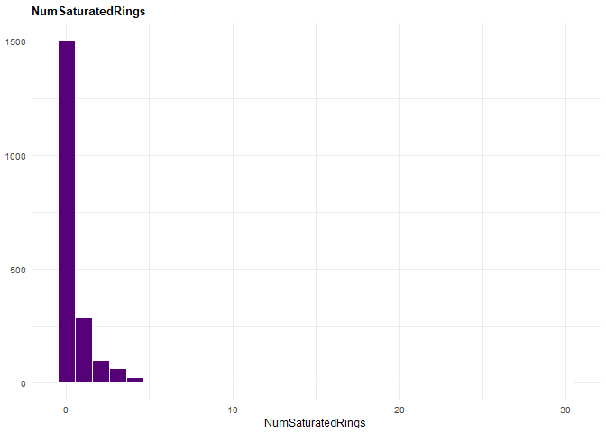


    [[13]]

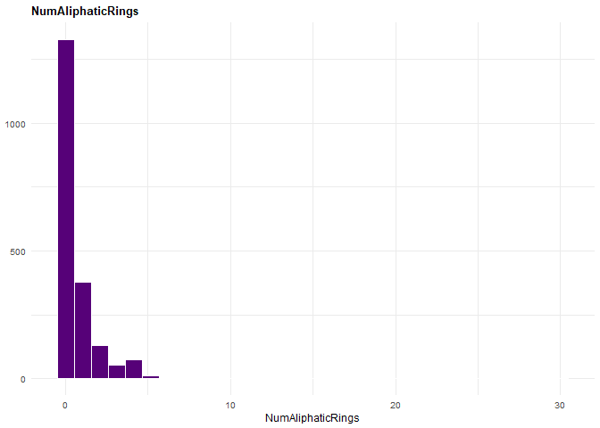


    [[14]]

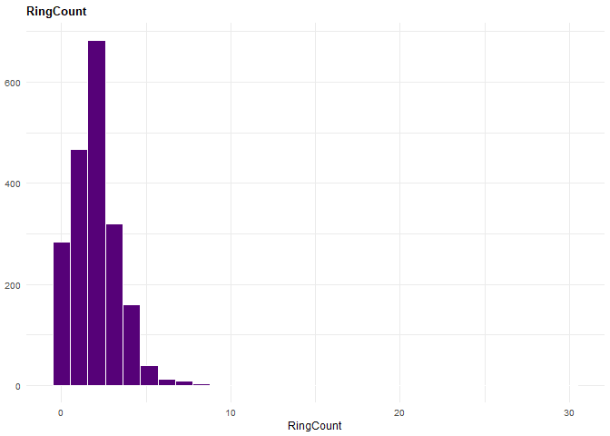


    [[15]]

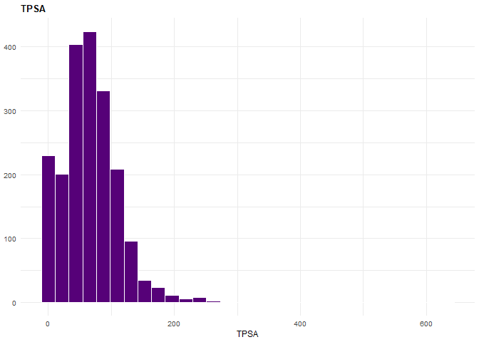


    [[16]]

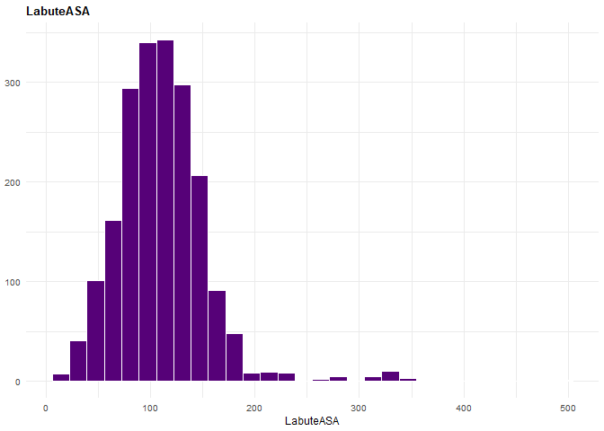


    [[17]]

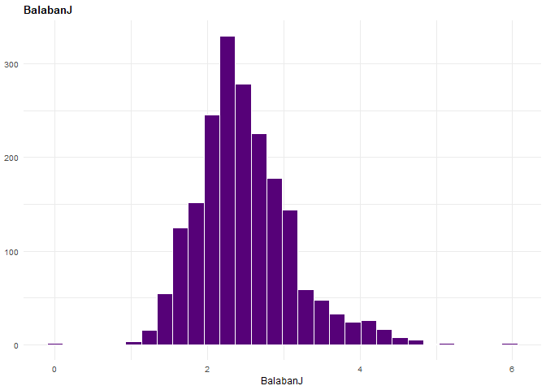


    [[18]]

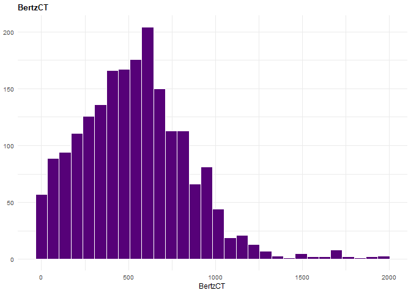


    [[19]]

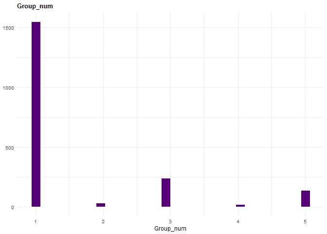

Creating a new column called Lipinski:

``` r
df$Lipinski <- NA
```

Assigning the values based on the Lipinski rule of 5.

``` r
df$Lipinski[df$MolWt < 500 & df$MolLogP < 5 & df$NumHAcceptors < 10 & df$NumHDonors < 5] = 0
df$Lipinski[df$MolWt < 500 & df$MolLogP > 5 & df$NumHAcceptors < 10 & df$NumHDonors < 5] = 1
df$Lipinski[df$MolWt < 500 & df$MolLogP < 5 & df$NumHAcceptors > 10 & df$NumHDonors < 5] = 1
df$Lipinski[df$MolWt < 500 & df$MolLogP < 5 & df$NumHAcceptors < 10 & df$NumHDonors > 5] = 1
df$Lipinski[df$MolWt > 500 & df$MolLogP < 5 & df$NumHAcceptors < 10 & df$NumHDonors < 5] = 1
df$Lipinski[df$MolWt > 500 & df$MolLogP > 5 & df$NumHAcceptors < 10 & df$NumHDonors < 5] = 2
df$Lipinski[df$MolWt > 500 & df$MolLogP < 5 & df$NumHAcceptors > 10 & df$NumHDonors < 5] = 2
df$Lipinski[df$MolWt > 500 & df$MolLogP < 5 & df$NumHAcceptors < 10 & df$NumHDonors > 5] = 2
df$Lipinski[df$MolWt < 500 & df$MolLogP > 5 & df$NumHAcceptors > 10 & df$NumHDonors < 5] = 2
df$Lipinski[df$MolWt < 500 & df$MolLogP > 5 & df$NumHAcceptors < 10 & df$NumHDonors > 5] = 2
df$Lipinski[df$MolWt < 500 & df$MolLogP < 5 & df$NumHAcceptors > 10 & df$NumHDonors > 5] = 2
df$Lipinski[df$MolWt > 500 & df$MolLogP > 5 & df$NumHAcceptors > 10 & df$NumHDonors < 5] = 3
df$Lipinski[df$MolWt > 500 & df$MolLogP < 5 & df$NumHAcceptors > 10 & df$NumHDonors > 5] = 3
df$Lipinski[df$MolWt < 500 & df$MolLogP > 5 & df$NumHAcceptors > 10 & df$NumHDonors > 5] = 3
df$Lipinski[df$MolWt > 500 & df$MolLogP > 5 & df$NumHAcceptors > 10 & df$NumHDonors > 5] = 4
```

Looking at the resulted column values:

``` r
table(df$Lipinski)
```


       0    1    2    3 
    1717  206   15    8 

Writting it to take this version of the data file to python

``` r
write.csv(df, "df.csv")
```
